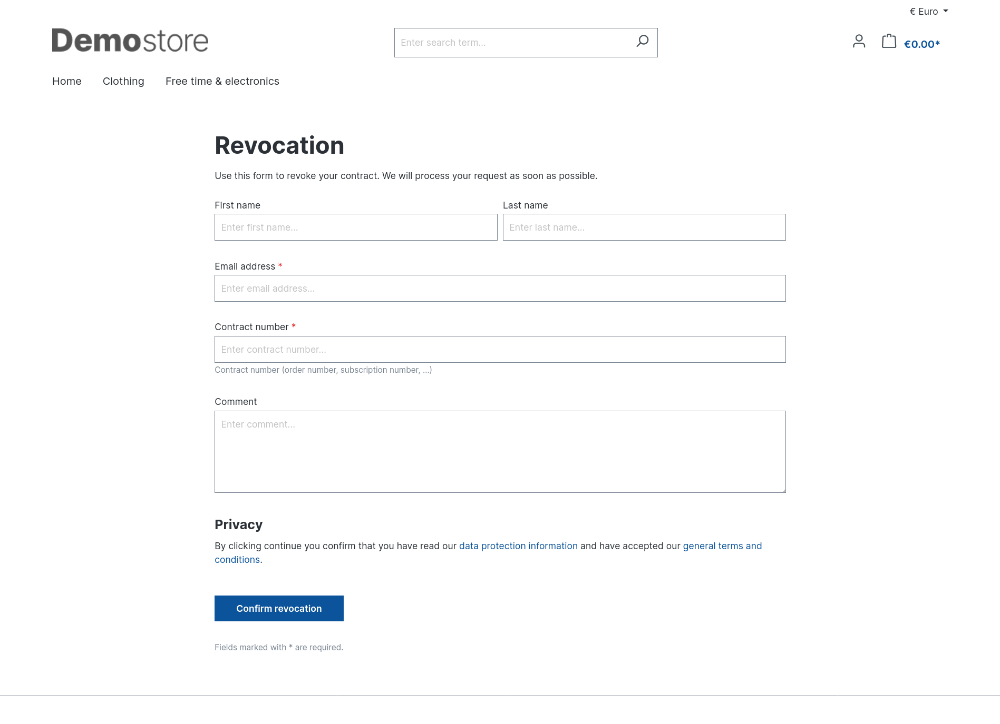
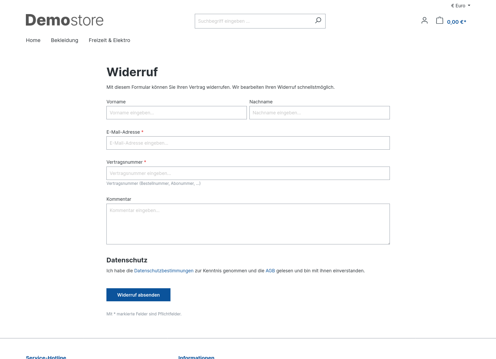
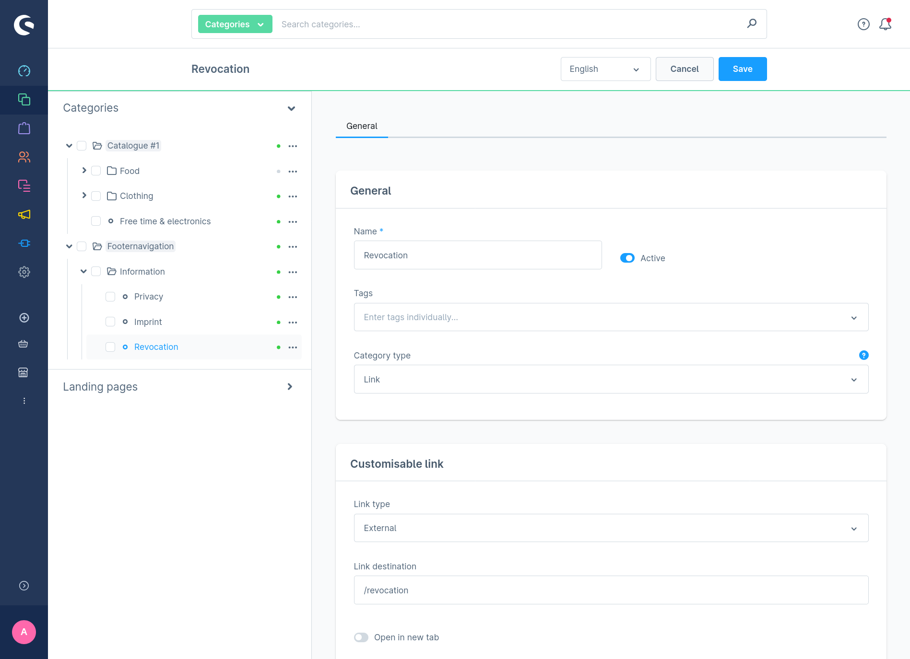
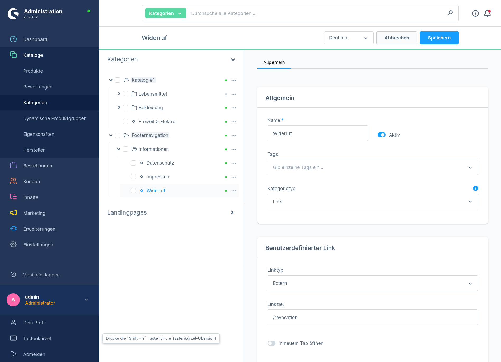
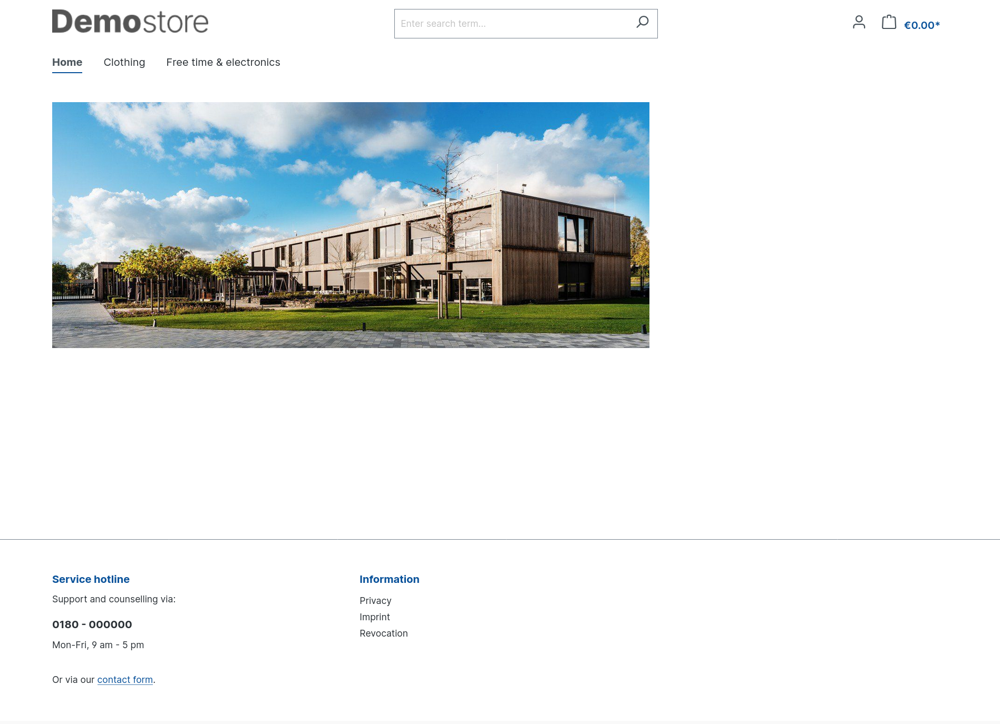
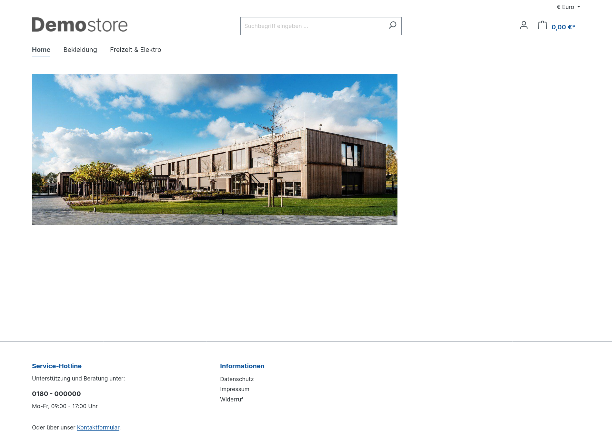

# Revocation Button for Shopware 6.4 / 6.5

A Shopware plugin that adds the legally mandated revocation button to the storefront,
similar to the native Shopware 6.6/6.7 implementation.

## Compatibility

- PHP 7.4+ / 8.x
- Shopware `~6.4.12 || ~6.5.0`

## What it does

- Exposes a revocation form at `/revocation` with the fields:
  first name, last name, email, contract number and comment.
- Sends two admin-editable mails on submission:
  - `codebarista_revocation_request.merchant` — to the shop operator.
  - `codebarista_revocation_request.customer` — confirmation to the customer.
  Both can be customised under *Settings → Email templates*.

<table>
  <tr>
    <td></td>
    <td></td>
  </tr>
  <tr>
    <td align="center">Storefront form (English)</td>
    <td align="center">Storefront form (German)</td>
  </tr>
</table>

## How to use it

> [!IMPORTANT]
> Always test new plugin versions in a dev environment before using them in a production/live shop.

1. Download the ZIP archive from the latest [release](https://github.com/codebarista-de/revocationbutton/releases).
2. Log in to the Admin UI of your shop and go to `Extensions > My extensions`.
3. Click `Upload extension` and select the downloaded ZIP archive.
4. Find the `Revocation Button` extension in the list.
5. Install and activate it.

### Adding the revocation link to the storefront

The plugin does not auto-inject the link, so you keep full control over
placement, label and visibility. To add the link the same way imprint and
privacy are exposed:

1. **Admin → Catalogues → Categories** — create a new category, e.g. "Revocation" in the [service menu category tree](https://docs.shopware.com/en/shopware-6-en/tutorials-and-faq/basic-setup).
2. Set **Type = Link**, then pick **External link** and enter the relative URL `/revocation` and activate the category.
3. Save and clear caches. The link now appears in the service menu.

<table>
  <tr>
    <td></td>
    <td></td>
  </tr>
  <tr>
    <td align="center">Admin category configuration (English)</td>
    <td align="center">Admin category configuration (German)</td>
  </tr>
  <tr>
    <td></td>
    <td></td>
  </tr>
  <tr>
    <td align="center">Revocation link (English)</td>
    <td align="center">Revocation link (German)</td>
  </tr>
</table>

### Configuration

Configure under *Settings → Plugins → Revocation Button → Configure*.

| Setting | Default | Description |
|---|---|---|
| Merchant notification - inbox address | shop email (*Settings → Basic information*) | Inbox that receives the notification each time a customer submits the form. |
| Merchant notification - inbox display name | inbox address | Display name shown in the `To:` header of the merchant notification. |
| Outgoing mail - From: address | merchant inbox address | `From:` used for **both** outgoing mails. |
| Outgoing mail - From: display name | sales channel name | `From:` display name used for **both** outgoing mails. |

## License

MIT — see [LICENSE](LICENSE).
